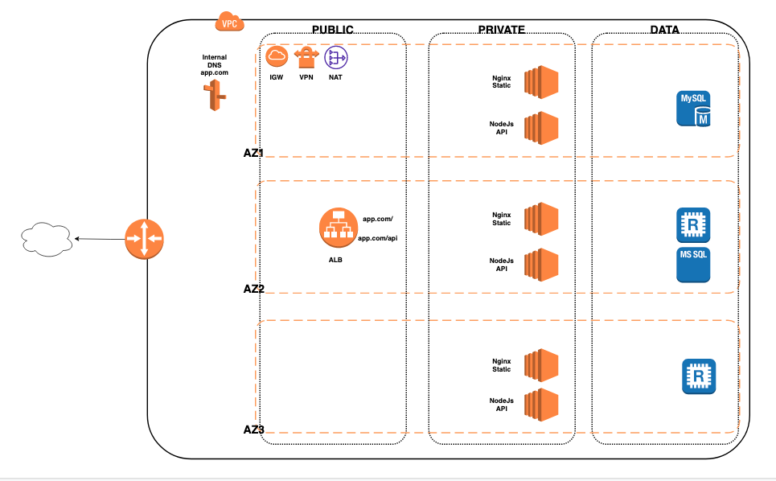

# General Diagram



### Terraform State
The project was divided into 2 parts, each have its own terraform state to isolate/separate acutal infra and application.
1. `resources/app`   - Contains Resources needed to run the application such as EC2, RDS, ALB etc.
2. `resources/infra` - Contains the AWS cloud infra such as VPC, SUBNETS, ROUTING, etc.

### Versions and Environment
```
aws-cli/2.4.3 Python/3.8.8 Darwin/21.2.0 exe/x86_64
Terraform v1.1.4
provider registry.terraform.io/hashicorp/aws v3.67.0

Downlaod Terraform Binary : https://releases.hashicorp.com/terraform/
```

### Usage
```
cd to resources/{app | infra}

terraform init -backend-config=../../backend/backend-{workspace}-app.tf
terraform init -backend-config=../../backend/backend-{workspace}-infra.tf

terraform plan  -var-file=./vars-{workspace}.tfvars

terraform apply  -var-file=./vars-{workspace}.tfvars

```
### Structure
```
.
├── README.md
├── backend
│   └── backend-{workspace}-{app|infra}.tf
└── resources
    ├── app
    │   ├── compute
    │   │   ├── alb
    │   │   └── autoscale
    │   ├── data
    │   │   ├── rds
    │   │   └── redis
    │   ├── network
    │   │   └── secgroup
    │   ├── main.tf
    │   ├── variables.tf
    │   └── vars-{worksapce}.tfvars
    └── infra
        ├── subnets
        └── vpc
        ├── main.tf
        ├── variables.tf
        └── vars-{worksapce}.tfvars
```


### Modules

Each modules has a README with documentation:

- [VPC](./resources/infra/vpc/README.md)
- [Subnet](./resources/infra/subnets/README.md)
- [Autoscaling Group](./resources/app/compute/autoscale/README.md)
- [Application Load Balancer](./resources/app/compute/alb/README.md)
- [RDS](./resources/app/data/rds/README.md)
- [Redis](./resources/app/data/redis/README.md)
- Security Group
